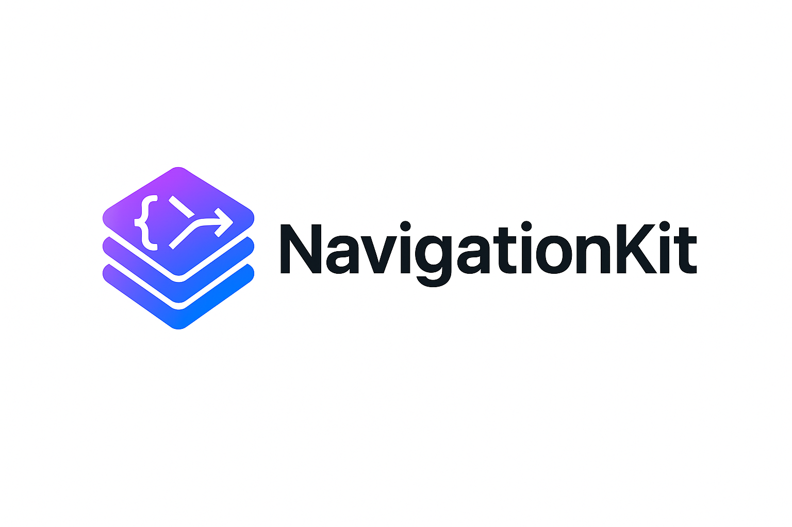

# NavigationKit by Pedro M. Moreno

`NavigationKit` is a lightweight SwiftUI SDK that provides a **decoupled navigation architecture** with a single `Coordinator` and a `RootHostView`. It solves a common problem in SwiftUI apps: navigation logic scattered across views, leading to tight coupling, brittle flows, and hard-to-test code.

With NavigationKit you get:

- A **centralized** navigation state via `Coordinator`.
- **Type-safe** routing without resorting to `AnyView` in the presentation layer.
- Clean integration with `NavigationStack` and **navigationDestination**.
- Built-in support for **push navigation**, **sheets**, and **full-screen covers**.
- Works great with or without DI frameworks (e.g., Swinject), but **does not require** DI.

---

## 🚀 Table of Contents

1. [Technical Specifications](#technical-specs)
2. [Targets](#targets)
3. [Installation](#installation)
4. [Features](#features)  
5. [Usage](#usage)  
6. [Structure](#structure)  
7. [Testing](#testing)  
8. [Tips](#tips)  

---

<a name="technical-specs"></a>
## 🛠 Technical Specifications

- **Language:** Swift 5.9+
- **Framework:** SwiftUI
- **Platforms:** iOS 16.0+
- **Architecture:** MVVM-friendly, Coordinator-based, decoupled routes
- **Package Manager:** Swift Package Manager (SPM)
- **Safety:** No force unwrapping in the SDK; no `AnyView` required for view building

---

<a name="targets"></a>
## 🎯 Targets

### 1. `PMM_NavigationKit` (core)
The SDK you depend on in your app. It includes:

- `Coordinator` — central navigation manager.
- `ModalItem` — small wrapper to drive sheet/full-screen presentation by item.
- `RootHostView` — hosts your root `NavigationStack`.
- `View+Register` — extension to register **type-safe** destinations per route.

### 2. `PMM_NavigationKitExamplesSupport` (optional)
Ready-to-use **example views and routes** to try the SDK quickly.

- Contains two example sets:
  - **Simple** — minimal list → detail.
  - **HomeFlow** — a slightly more structured example using a flow builder.
- **No `@main` files** here. The runnable app entry points live in `Examples/` (not compiled, reference only).
- This target is **optional** — consumers add it only if they want the examples in their app target.

---

<a name="installation"></a>
## 📦 Installation

### Xcode (UI)
1. **File → Add Packages…**
2. Paste the repository URL.
3. Select products:
   - Always select **PMM_NavigationKit**.
   - Optionally select **PMM_NavigationKitExamplesSupport** if you want the example views/routes.

### Swift Package Manager (`Package.swift`)
```swift
dependencies: [
    .package(url: "https://github.com/your-username/NavigationKit.git", from: "1.0.0")
],
targets: [
    .target(
        name: "MyApp",
        dependencies: [
            "PMM_NavigationKit",
            // "PMM_NavigationKitExamplesSupport" // optional
        ]
    )
]
```

<a name="features"></a>
## ✨ Features
### Coordinator
Centralizes navigation actions and state:

- Push: show(_:) appends a typed route to the main NavigationPath.
- Back: back() pops one element; reset() clears the stack.
- Pop to Root: popToRoot() resets the navigation path.
- Modals:
    - sheetItem + sheetPath — present and navigate inside a sheet.
    - fullCoverItem + fullCoverPath — present and navigate inside a full-screen cover.
    - presentSheet(_:), dismissSheet()    
    - presentFullCover(_:), dismissFullCover()
    
> **_Note:_** the SDK uses ModalItem (an Identifiable wrapper) for sheets/full covers. You decide which views to present for each modal route in your app.

### ModalItem
A tiny, Identifiable wrapper around a route that drives sheet(item:) and fullScreenCover(item:).
This keeps modal presentation type-safe and SwiftUI-friendly without AnyView.

### RootHostView
A thin host for your root NavigationStack. It receives a typed root view and exposes the NavigationPath via the Coordinator.

You register route destinations on the root view you pass into RootHostView (see Usage below). This ensures navigationDestination is always inside the stack.

### View+Register
A convenience extension that maps a route type to its destination view without AnyView. You can stack multiple register(...) calls to support multiple route enums from different features.

<a name="usage"></a>
## 🚦 Usage
### 1. Define routes
```swift
enum HomeRoute: Hashable {
    case root
    case detail(id: UUID)
}
```

### 2. Create views
```swift
import SwiftUI
import PMM_NavigationKit

struct HomeView: View {
    @EnvironmentObject private var coordinator: Coordinator
    let items = [UUID(), UUID(), UUID()]

    var body: some View {
        List(items, id: \.self) { id in
            Button("Go to detail \(id)") {
                coordinator.show(HomeRoute.detail(id: id))
            }
        }
        .navigationTitle("Home")
    }
}

struct DetailView: View {
    let id: UUID
    var body: some View {
        Text("Detail: \(id.uuidString)")
            .padding()
    }
}

```
### 3. Wire it up with RootHostView and register(...)
> **_Important:_** The .register(...) must be applied inside the root view you pass to RootHostView. If you attach it outside, SwiftUI will warn that navigationDestination is misplaced and it will be ignored.


```swift
import SwiftUI
import PMM_NavigationKit

@main
struct DemoApp: App {
    @StateObject private var coordinator = Coordinator()

    var body: some Scene {
        WindowGroup {
            RootHostView(
                root:
                    HomeView()
                        .register(HomeRoute.self) { route in
                            switch route {
                            case .root:
                                HomeView()
                            case .detail(let id):
                                DetailView(id: id)
                            }
                        }
            )
            .environmentObject(coordinator) // inject the single Coordinator instance
        }
    }
}
```

### 4. (Optional) Present a Sheet or Full-Screen Cover
Your **Coordinator** already supports modals. A minimal pattern is:

```swift
enum HomeSheetRoute: Hashable { case addItem }

struct AddItemView: View {
    @EnvironmentObject private var coordinator: Coordinator
    @State private var title = ""
    var body: some View {
        Form {
            TextField("Title", text: $title)
            Button("Save & Close") { coordinator.dismissSheet() }
                .disabled(title.isEmpty)
        }
        .navigationTitle("Add Item")
    }
}
```

Presenting from any view:

```swift
Button("Add (Sheet)") { coordinator.presentSheet(HomeSheetRoute.addItem) }
```

Render the sheet in your app entry (or in a tiny “shell” view if you prefer), using sheet(item:):
```swift
RootHostView(
    root:
        HomeView()
            .register(HomeRoute.self) { route in /* ... */ }
)
.environmentObject(coordinator)
.sheet(item: $coordinator.sheetItem, onDismiss: { coordinator.dismissSheet() }) { item in
    NavigationStack(path: $coordinator.sheetPath) {
        if let r = item.route as? HomeSheetRoute {
            AddItemView()
        } else {
            Text("Unsupported sheet route")
        }
    }
}
```

> You can do the same with **fullScreenCover(item:) { ... }** using **fullCoverItem** and **fullCoverPath**.

<a name="structure"></a>
## 📂 Structure
```bash
PMM_NavigationKit/
├─ Package.swift
├─ Sources/
│  ├─ PMM_NavigationKit/                ← Core SDK
│  │  ├─ Coordinator.swift
│  │  ├─ ModalItem.swift
│  │  ├─ RootHostView.swift
│  │  └─ View+Register.swift
│  └─ PMM_NavigationKitExamplesSupport/ ← Optional example views (no @main)
│     ├─ Common/
│     │  ├─ Routes.swift
│     │  ├─ Item.swift
│     │  ├─ HomeView.swift
│     │  └─ DetailView.swift
│     ├─ Simple/
│     │  └─ SimpleExampleApp.swift      ← @main example, excluded from build 
│     └─ HomeFlow/
│        ├─ HomeFlow.swift
│        ├─ HomeFlowExampleApp.swift
│        └─ SimpleExampleApp.swift      ← @main example, excluded from build 
└─ Tests/
   └─ PMM_NavigationKitTests/
```

<a name="testing"></a>
## 🧪 Testing
_Coming soon._

We plan to include:
- Coordinator unit tests (push/pop, sheet/fullCover logic)
- UI tests for push and modal flows
- Snapshot tests for example views

<a name="tips"></a>
## 💡 Tips
- Always apply .register(...) inside the view passed to RootHostView.
- Inject one Coordinator instance via .environmentObject.
- No AnyView or unsafe casts.
- Works with or without dependency injection.
- If you later add DI, inject factories/services into your flows or views. Nothing in PMM_NavigationKit depends on DI.
